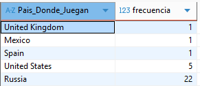
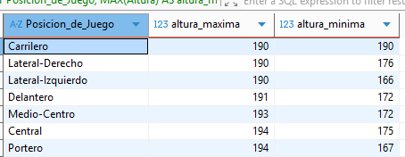
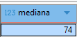
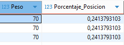
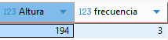

# Evidencia 5 y 6

## Parte_1-Generación de Datos

Genere datos aleatorios de jugadores llamados a la selección.

Use la herramienta para generar datos ficticios de mokaroot, aunque es muy intuitiva tuve ciertas dificúltales para ajustar los datos a como yo los quería.

Sin embargo te da la facilidad de descargar los datos muy rápido y no genero errores, al momento de correrlos.
En lo que le pondría una dificultad fue al momento de generar los datos de la tabla me dio comandos largo y cada dato por persona las tuve que ejecutar de una por una.

No modifique el código, porque mi intención era presentar este inconveniente.

Adjunto evidencia de lo explicado

**<u>Asi me presento  la información</u>**


```sql
insert into MOCK_DATA (Nombre, Apellido, Fecha_de_Cumpleaños, gender, Peso, Altura, Pais_Donde_Juegan, Jugo_Mundial, Jugo_Copa_America, Posicion_de_Juego ) values ('Reggi', 'Cabrales', '1985-07-25', 'Male', 65, 194, 'United Kingdom', 'Si', 'NO', 'Portero');
insert into MOCK_DATA (Nombre, Apellido, Fecha_de_Cumpleaños, gender, Peso, Altura, Pais_Donde_Juegan, Jugo_Mundial, Jugo_Copa_America, Posicion_de_Juego ) values ('Cassaundra', 'Sommerled', '1987-09-24', 'Male', 81, 190, 'Russia', 'Si', 'NO', 'Lateral-Izquierdo');
insert into MOCK_DATA (Nombre, Apellido, Fecha_de_Cumpleaños, gender, Peso, Altura, Pais_Donde_Juegan, Jugo_Mundial, Jugo_Copa_America, Posicion_de_Juego ) values ('Vivie', 'Say', '2008-01-04', 'Male', 68, 190, 'Russia', 'NO', 'NO', 'Carrilero');
insert into MOCK_DATA (Nombre, Apellido, Fecha_de_Cumpleaños, gender, Peso, Altura, Pais_Donde_Juegan, Jugo_Mundial, Jugo_Copa_America, Posicion_de_Juego ) values ('Erminia', 'Poile', '1997-08-11', 'Male', 74, 189, 'Mexico', 'NO', 'NO', 'Central');
```

**<u>Yo lo hubiera colocado de esta manera, para poder correrlo todos juntos</u>**
```sql
INSERT INTO MOCK_DATA 
(Nombre, Apellido, Fecha_de_Cumpleaños, gender, Peso, Altura, Pais_Donde_Juegan, Jugo_Mundial, Jugo_Copa_America, Posicion_de_Juego) 
VALUES
('Brianne', 'Aronstein', '1987-10-05', 'Male', 74, 174, 'Russia', false, false, 'Lateral-Izquierdo'),
('Christa', 'Birdall', '1997-12-06', 'Male', 74, 165, 'United States', true, false, 'Portero'),
('Kendra', 'Padley', '1989-11-18', 'Male', 65, 171, 'Russia', true, true, 'Medio-Centro'),
```

## Parte_2- Funciones de Agregación

### Conteo de Frecuencias

```sql
SELECT Pais_Donde_Juegan, COUNT(*) AS frecuencia
FROM MOCK_DATA
GROUP BY Pais_Donde_Juegan
ORDER BY frecuencia ASC;
```



Generamos una tabla de frecuencias de en qué país juegan los jugadores de la selección ordenados de forma ascendente

### Máximos y Mínimos


```sql
SELECT Posicion_de_Juego, MAX(Altura) AS altura_maxima,Min(Altura) as altura_minima
FROM MOCK_DATA
GROUP BY Posicion_de_Juego
ORDER BY altura_maxima,altura_minima DESC;
```




Se generan los máximos y mínimos agrupados y ordenados de forma descendente 

### Media

```sql
SELECT AVG(Peso) AS mediana
FROM (
    SELECT Peso,
           ROW_NUMBER() OVER (ORDER BY Peso) AS fila,
           COUNT(*) OVER () AS total
    FROM MOCK_DATA
) AS ordenados
WHERE fila IN (FLOOR((total + 1) / 2), FLOOR((total + 2) / 2));
```




Se genera la fórmula de la media, pero haciendo adecuaciones para que me dé un numero cerrado y no en decimales, por lo cual se usa el floor 


### Cuartiles 

```sql
SELECT Peso, Porcentaje_Posicion
FROM (
    SELECT Peso,
           PERCENT_RANK() OVER (ORDER BY Peso) AS Porcentaje_Posicion
    FROM MOCK_DATA
) AS sub
WHERE Porcentaje_Posicion BETWEEN 0.24 AND 0.26
   OR Porcentaje_Posicion BETWEEN 0.49 AND 0.51
   OR Porcentaje_Posicion BETWEEN 0.74 AND 0.76;
```


Búsqueda de cuartiles diferentes de la mediana.

### Moda

```sql
SELECT Altura, COUNT(*) AS frecuencia
FROM MOCK_DATA
GROUP BY Altura
ORDER BY frecuencia DESC
LIMIT 1;
```


Altura más repetida en mis jugadores.


## Hallazgos

Encontré nuevas soluciones para sacar datos que creía ya sabía, en la parte de la media, tenía mis dato  de los pesos en decimales, por lo cual encontré la manera de aplicar un floor, para que me redondeara  el resultado, final.

## Dificultades.

Al momento de pedir los cuartiles, yo primero solicite directamente con el código .25,.75.
Sin embargo no te da el número exacto, por lo cual me aparecía en cero y tuve que buscar números  aproximados al 1 y 3 cuartil.

Las soluciones aplicadas al reporte fueron explicadas previamente.
