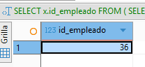

# EVIDENCIA_7

## Inconsistencias en mi base de Datos. 

En esta ocasión, pude corregir una inconsistencia que se presentaba desde el principio de mis reportes, en la tarea 4, cuando realizaba mis tablas, las cuales no me dejaba correr mi formato.
Tengo 4 tablas, departamento, empleado, puesto y evaluación;al momento de ingresar todos, no hubo ningún problema, a excepción de la evaluación. 
Me aparecía que tenía valores que no coincidían con el PK  que es mi caso es id_empleado.

```sql
SELECT x.id_empleado
FROM (
  SELECT 1 AS id_empleado UNION ALL
  SELECT 2 UNION ALL SELECT 3 UNION ALL SELECT 4 UNION ALL SELECT 5 UNION ALL
  SELECT 6 UNION ALL SELECT 7 UNION ALL SELECT 8 UNION ALL SELECT 9 UNION ALL
  SELECT 10 UNION ALL SELECT 11 UNION ALL SELECT 12 UNION ALL SELECT 13 UNION ALL
  SELECT 14 UNION ALL SELECT 15 UNION ALL SELECT 16 UNION ALL SELECT 17 UNION ALL
  SELECT 18 UNION ALL SELECT 19 UNION ALL SELECT 20 UNION ALL SELECT 21 UNION ALL
  SELECT 22 UNION ALL SELECT 23 UNION ALL SELECT 24 UNION ALL SELECT 25 UNION ALL
  SELECT 26 UNION ALL SELECT 27 UNION ALL SELECT 28 UNION ALL SELECT 29 UNION ALL
  SELECT 30 UNION ALL SELECT 31 UNION ALL SELECT 32 UNION ALL SELECT 33 UNION ALL
  SELECT 34 UNION ALL SELECT 35 UNION ALL SELECT 36 UNION ALL SELECT 37 UNION ALL
  SELECT 38 UNION ALL SELECT 39
) AS x
LEFT JOIN Empleado e ON x.id_empleado = e.id_empleado
WHERE e.id_empleado IS NULL;
```


 Con esto realice una subconsulta agrupando  en X y generando una tabla virtual para agrupar todos los valores de id_empleado, después se hace un left join para cruzar x.id_empleado = e.id_empleado, donde ( e ) hace referencia a la tabla Empleados.
Y así me salió mi erro, en el cual en mi tabla de Empleado  no tenía al empleado con el <u>id 36</u>.

## Subconsultas para resolver preguntas relevantes.

<u>Empleado que tiene mejor desempeño que el promedio general.</u>

```sql
SELECT nombre, apellido, id_empleado
FROM Empleado
WHERE id_empleado IN (
    SELECT id_empleado
    FROM Evaluacion
    WHERE promedio_desempeno > (
        SELECT AVG(promedio_desempeno)
        FROM Evaluacion
    )
);
```
<u>Qué departamentos tienen mejor promedio de desempeño entre sus empleados</u>

```sql
SELECT d.nombre_departamento, dept_avg.promedio_departamento
FROM (
    SELECT e.id_departamento, AVG(ev.promedio_desempeno) AS promedio_departamento
    FROM Empleado e
    JOIN Evaluacion ev ON e.id_empleado = ev.id_empleado
    GROUP BY e.id_departamento
) AS dept_avg
JOIN Departamento d ON d.id_departamento = dept_avg.id_departamento
ORDER BY dept_avg.promedio_departamento DESC;
```

## Hallazgos 

*Se logró corregir mi base de datos, que aunque yo pensaba que los registro que había tomado en un principio estaban del todo bien, tenía registro del personal de la empresa la cual, ya no estaba en ella, con una validación y un join, logre identificar la diferencia y poder corregir mi base de datos.

*La primera subconsulta es sencilla, en la cual estoy utilizando 2 tablas Empleado y Evaluación para saber  que empleado tiene mejor desempeño a nivel general.

*En la segunda si fue un poco más complicado, en la cual calcule promedios, agrupe e hice un join entre tablas, para después usar tablas temporales como dev_avg, y poder sacar el nombre del departamento y su promedio. 


