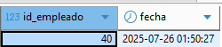

### Evidencia_8

## Creación de view sobre consultas significativas.

# 1-Join 

En esta utilizare una subconsulta generada en mi tarea anterior, debido a que ahí realice    un join, y le genero adicional una view, en el cual sirve para ver qué departamento tiene mejor desempeño entre sus empleados.

```sql
CREATE VIEW VistaPromedioDesempenoDepartamento AS
SELECT d.nombre_departamento, dept_avg.promedio_departamento
FROM (
    SELECT e.id_departamento, AVG(ev.promedio_desempeno) AS promedio_departamento
    FROM Empleado e
    JOIN Evaluacion ev ON e.id_empleado = ev.id_empleado
    GROUP BY e.id_departamento
) AS dept_avg
JOIN Departamento d ON d.id_departamento = dept_avg.id_departamento;

SELECT * FROM VistaPromedioDesempenoDepartamento
ORDER BY promedio_departamento DESC;
```

# 2- Left Join 

En esta es una consulta sencilla la cual realizo el join para saber a los empleados y su evaluación.

```sql
CREATE VIEW VistaEmpleadosConEvaluacion AS
SELECT 
  e.id_empleado,
  e.nombre,
  e.apellido,
  e.id_departamento,
  ev.promedio_desempeno
FROM Empleado e
LEFT JOIN Evaluacion ev ON e.id_empleado = ev.id_empleado;

SELECT * FROM VistaEmpleadosConEvaluacion;
```

# 3-Right Join 

Esta vista es útil si por alguna razón tengo  evaluaciones de empleados que ya no están en la tabla Empleado.


```sql
CREATE VIEW VistaRJEvaluaciones AS
SELECT 
  e.id_empleado,
  e.nombre,
  ev.promedio_desempeno
FROM Empleado e
RIGHT JOIN Evaluacion ev ON e.id_empleado = ev.id_empleado;

SELECT * FROM VistaRJEvaluaciones;
```

# 4-Subconsulta 

En esta de la tabla Evaluación y Empleado, la vista me muestra el id, nombre, id_departamento y su promedio de desempeño sin embargo se realiza la subconsulta para ver el promedio del departamento.

```sql
CREATE VIEW VistaComparacionDesempeno AS
SELECT 
  e.id_empleado,
  e.nombre,
  e.id_departamento,
  ev.promedio_desempeno,
  (
    SELECT AVG(ev2.promedio_desempeno)
    FROM Empleado e2
    JOIN Evaluacion ev2 ON e2.id_empleado = ev2.id_empleado
    WHERE e2.id_departamento = e.id_departamento
  ) AS promedio_departamento
FROM Empleado e
JOIN Evaluacion ev ON e.id_empleado = ev.id_empleado;

SELECT * FROM VistaComparacionDesempeno
ORDER BY promedio_desempeno DESC;
```

# Creación de Disparador (trigger) Insert

En esta primero cree una tabla de bitácora donde me registrara con id_bitacora, id_empleado, acción y fecha de registro.

Después con el trigger indique que se generara un registro cada que se incluya un nuevo empleado.

A su vez hice un insert de un empleado adicional, y realice una selección de la tabla bitácora que me diera el dato agregado.

```sql
CREATE TABLE BitacoraCambios (
    id_bitacora INT AUTO_INCREMENT PRIMARY KEY,
    id_empleado INT,
    accion VARCHAR(20),
    fecha TIMESTAMP DEFAULT CURRENT_TIMESTAMP
);

CREATE TRIGGER trigger_insert_empleado
AFTER INSERT ON Empleado
FOR EACH ROW
BEGIN
    INSERT INTO BitacoraCambios (id_empleado, accion)
    VALUES (NEW.id_empleado, 'INSERT');
END;

INSERT INTO Empleado (
    nombre,
    apellido,
    fecha_nacimiento,
    direccion,
    telefono,
    correo_electronico,
    fecha_contratacion,
    id_departamento,
    id_puesto
) VALUES (
    'Juan',
    'Pérez',
    '1990-05-15',
    'Av. Reforma 123, CDMX',
    '+525512345678',
    'juan.perez@email.com',
    '2025-07-26',
    1,
    1
);

SELECT id_empleado, fecha FROM BitacoraCambios;
```



