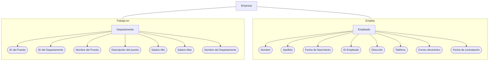

# **TAREA 2**

## °Base de datos modelo entidad relacion

En esta ocasión muestro mi modelo entidad relación, en la cual muestro un conjunto de datos, cabe aclarar que estos datos son ficticios, por lo cual no sé si se presente algún inconveniente.

Se muestra la información de una empresa con una empleabilidad de 300 personas, en la cual se visualiza las entidades, atributos y relaciones correspondientes. 

