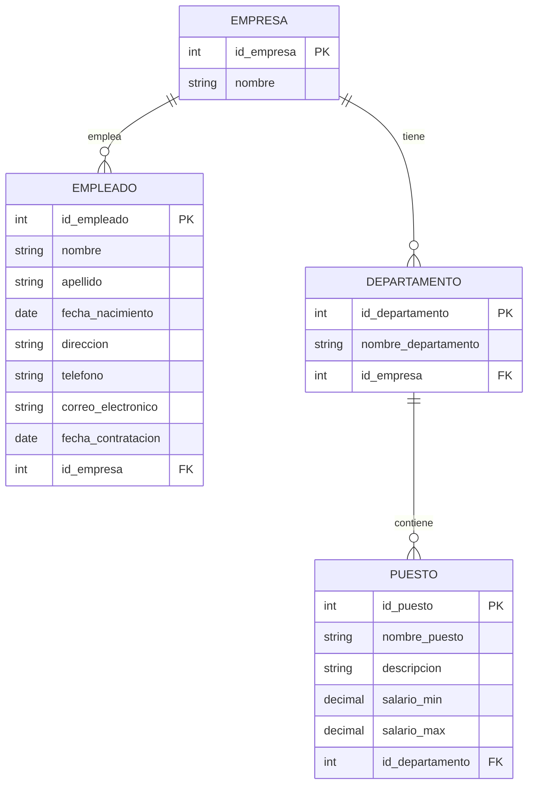

# *Prueba evidencia 3*

## Departamento 
id_departamento *(PK)*		
nombre_departamento		

## Puesto		
id_puesto *(PK)*		
nombre_puesto		
descripcion		
salario_min		
salario_max		
id_departamento(FK)		
		
## Empleado		
id_empleado *(PK)*		
nombre		
apellido		
fecha_nacimiento		
direccion		
telefono		
correo_electronico		
fecha_contratacion		
id_departamento *(FK)*		
id_puesto *(FK)*		

## Evaluacion_Empleado 
Id_empleado *(PK)*
Puntualidad
Productivdad
Calidad_trabajo
Cumplimiento_objetivos
Trabajo_en_equipo
Disiplina
Antigüedad
Capacitación
Promedio_desempeño

En esta tarea continuamos viendo el modelo entidad relacion.
Posteriormente la intencion es mostrar algunas operaciones algebraicas.

# *Algebra relacional 4 operaciones*

### 1-Selección (σ) - Filtrar sueldos por arriba de los 40,000$ 

 <u>-σ  salario_max> 40,00 $ (Puesto) </u>.

En este ejemplo utilizamos la selección, es para saber que en el dato de los salarios mayores a 40,000 $,  de la tabla de Puestos actualizados.

### 2- Proyección –Obtener solo nombres y apellidos 

<u>-π nombre,apellido  ( Empleado)</u>.

En este me permite seleccionar subíndices y representa las variables.
Estamos pidiendo una proyección de los nombres y apellidos de la tabla Empleados

### 3- Producto Cartesiano –Nos permite combinar datos

<u>Departamento x Puesto</u>

Este nos funcionara para combinar filas de varias entidades, en el ejemplo quiero combinar la tabla de Departamento y Puesto.

### 4-Composicion- Identificar el nombre del departamento

<u>-Empleado x Departamento</u>

Combina Id_empleado con el nombre del departamento mediante el atributo ID del departamento